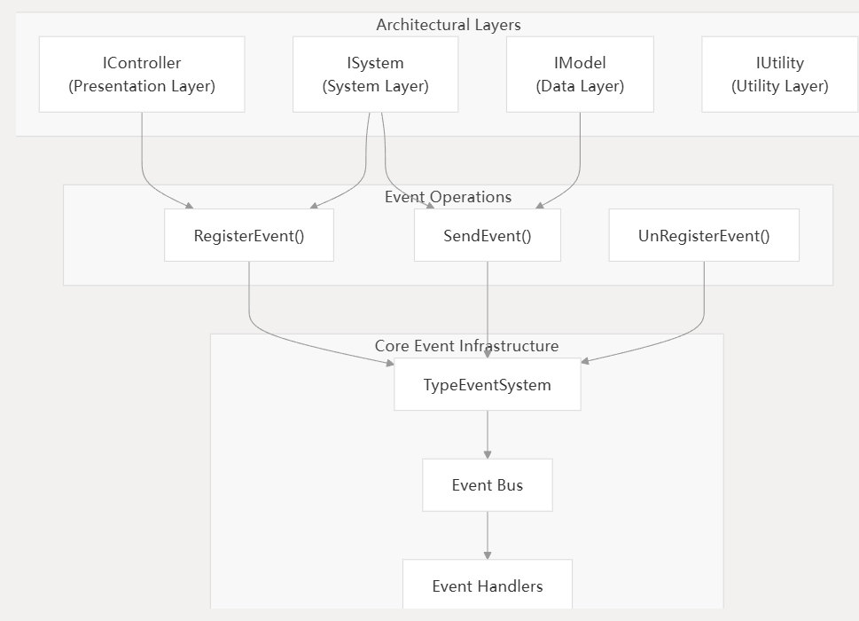

事件系统
======

事件系统为 QFramework 中的架构层提供事件驱动的通信。它通过允许组件通过事件而非直接引用进行通信来实现松散耦合，遵循下层通过事件与上层通信、上层通过方法调用与下层通信的原则。

有关整体架构层及其交互规则的信息，请参阅架构组件。有关命令的详细信息，命令补充事件系统以实现状态变化，请参阅命令和查询。

## 概述

QFramework 中的事件系统以 `TypeEventSystem` 类为核心构建，提供了一种集中化的机制用于事件驱动的通信。它支持数据变化通过事件向上流动，而控制通过方法调用和命令向下流动的架构原则。
事件系统架构

事件系统规则
--------

事件系统强制执行这些架构约束：

1. 向上通信：下层只能通过事件向上层进行通信
2. 事件类型：每个事件必须是不同的类型，以便正确路由
3. 处理器注册：组件必须明确注册它们想要接收的事件
4. 清理：事件处理器应该被注销以防止内存泄漏
5. 线程安全：事件操作应对并发访问保持线程安全
6. 层边界：事件遵循分层架构边界

------

事件系统架构
-------

## 事件流

事件生命周期管理
-------

事件系统管理事件从注册到清理的完整生命周期：

与架构组件集成
-------

事件系统与 QFramework 的其他组件紧密集成：

| 组件                | 事件使用        | 目的          |
| ----------------- | ----------- | ----------- |
| `Architecture<T>` | 为各层提供事件访问   | 事件操作中央协调器   |
| `IOCContainer`    | 管理事件处理器生命周期 | 确保事件订阅的正确清理 |
| `IController`     | 监听事件以更新 UI  | 接收状态变更通知    |
| `ISystem`         | 发送和接收事件     | 协调各层        |
| `IModel`          | 发送数据变更事件    | 通知数据修改      |
| `Command`         | 执行后可能触发事件   | 传递命令结果      |
